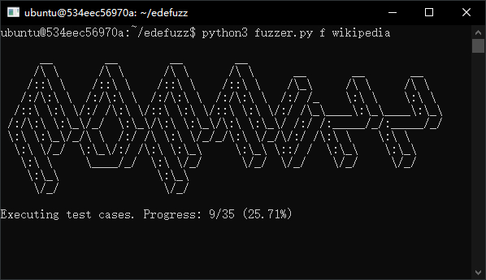
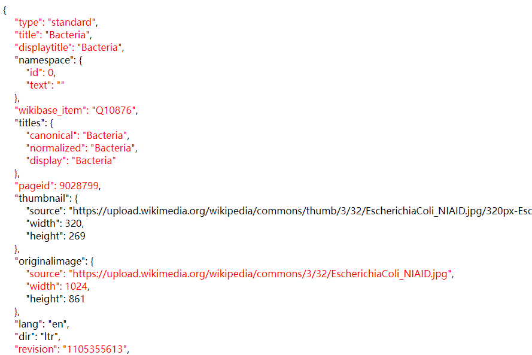

# EDEFuzz - Hunting excessive data exposure in web APIs

A tool to flag excessive data exposure vulnerabilities in web APIs. Tested on Ubuntu 20.04 and Windows 10 22H2.

## Folder structure

```
EDEFuzz
├── config: this folder stores configuration files, prepared manually (discussed in section 4.1)
│   ├── *.config: the configuration file, containing a sequence of instructions for EDEFuzz to interact with the web page under test
├── tests: contents in this folder are generated by the tool
│   ├── *.json: the API response produced by the server, used as a baseline in our experiments
│   └── *.data: the cached request-response pairs captured, allowing us to run a simulated server (discussed in section 4.2)
├── cache.py: to generate the cache file for a target API, used by `fuzzer.py`
├── constants.py: defines some constant values used in EDEFuzz, nothing special
├── database.py: database utility functions
├── engine.py: the fuzzer engine, used by `fuzzer.py` to execute test cases
├── fuzzer.py: main entry of EDEFuzz
├── mutate.py: generates mutations of an API response
├── README.md
└── report.py: the result analyser, used by `fuzzer.py` to analyse results
└── report_html.py: to generate the HTML file highlights flagged excessive fields, used by `report.py`
```


## Initial setup

### Docker setup

Run `sudo docker-compose up`. It will build two Docker images and run them. Once complete, and you should be able to see something begin with `edefuzz-mysql  | ...` indicating the database is running. 

- `edefuzz-mysql`: the database used by EDEFuzz to store data
- `edefuzz`: EDEFuzz will run within this container

If you encounter `http: invalid Host header` error, try `sudo snap refresh docker --channel=latest/edge`. You may find more information about this error in [this link](https://stackoverflow.com/a/77396079/4361701).


## Usage

(In a new terminal window, )Get into the Docker container `edefuzz`'s shell by: `docker exec -it edefuzz bash`. `cd` into EDEFuzz's folder by `cd edefuzz`.

### Preparation

- Create a configuration file under `config/` folder (discussed in section 4.1). You can find a few examples given in `config/` folder. 
- Run `python3 fuzzer.py c [target]` (e.g. `python3 fuzzer.py c wikipedia`) to generate request-response cache (used by simulated server in fuzzing stage, discussed in section 4.2). Note that configuration files provided by us may or may not work as those websites could have changed.

The request-response cache is stored at `tests/[target].data`. This process should typically take no more than a few seconds.

### Test execution

- Run `python3 fuzzer.py f [target]` to execute test cases (e.g. `python3 fuzzer.py f wikipedia`). The below screenshot indicates the test execution is in progress. 



The duration of this stage is mostly dependent on the number of mutants, ranging from a couple minutes to a few days. Outputs are stored in the database (the `edefuzz-mysql` Docker container). As a reference, the `wikipedia` example took around ten minutes on our end. 

### Analysing results

- Run `python3 fuzzer.py r [target]` to generate the results. The full process is discussed in section 4.4. 

Flagged excessive data fields are reported in `tests/[target].csv`. Each line in `tests/[target].csv` indicates an identified excessive data field. A more user-friendly output is generated in `tests/[target]_flagged.html` (an example is shown below), containing the original JSON object, with flagged excessive fields highlighted in red. 



A statistical summary is generated in `report_stat.csv`. Each line in `report_stat.csv` is in the form `[target name], [test duration (min)], [number of data fields in API], [number of executed test cases], [number of excessive fields flagged], [extra flags indicating why EDEFuzz failed (explained in section 5.2 RQ2)]`. This statistical summary is useful after testing multiple targets. 

## Dataset Used in Our Paper

### The Australian Dataset

| Appear in paper | Entity Name | [target] name used in EDEFuzz |
|---|---|---|
| Company-A | Australia Post | auspost |
| Company-B | Canvas | canvas |
| Company-C | Chemist Warehouse | cw |
| Company-D | Ikea Australia | ikea |
| Company-E | JB-HIFI | jb |
| Company-F | JetStar | jetstar |
| Company-G | Myer | myer |
| Company-H | Volkswagen Australia | volkswagen |


### The Alexa Top 200 Dataset

The Alexa top 200 dataset, less 131 that we excluded for numerous reasons (discussed in section 5.2 RQ2).

|  |  |  |  |  |  |
|---|---|---|---|---|---|
| 360 | 3dmgame | adobe | ali213 | alibaba | aliexpress |
| alipay | aliyun | amazon | apple | archive | baidu |
| bankofamerica | bilibili | binance | bing | cctv | chess |
| cnn | coinmarketcap | csdn | deepl | deviantart | douban |
| douyu | dropbox | etsy | freepik | hupu | ilive |
| imdb | imgur | iqiyi | ixigua | lenovo | linkedin |
| microsoft | msn | nytimes | paypal | pinterest | primevideo |
| qq | salesforce | shutterstock | sina | sogou | sohu |
| spotify | stackexchange | steamcommunity | telegram | theguardian | tiktok |
| tradingview | tumblr | twitter | weather | wetransfer | wikipedia |
| wordpress | yahoo | youdao | youku | youtube | zhihu |
| zhihuishu | zoho | zoom |


## License


This work is licensed under a [Creative Commons Attribution-NonCommercial-ShareAlike 4.0 International License](http://creativecommons.org/licenses/by-nc-sa/4.0/).
